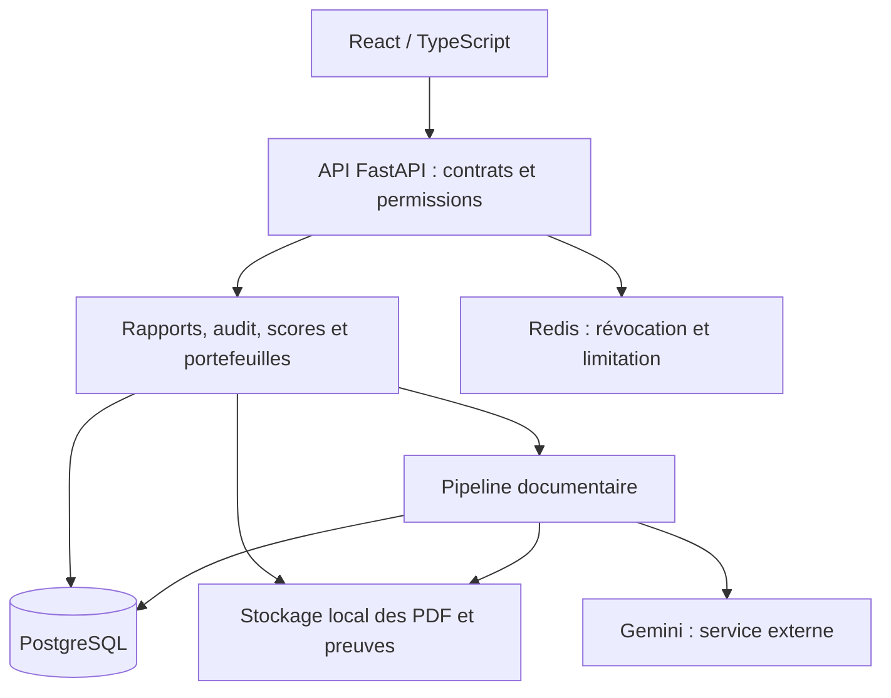
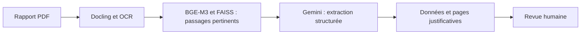
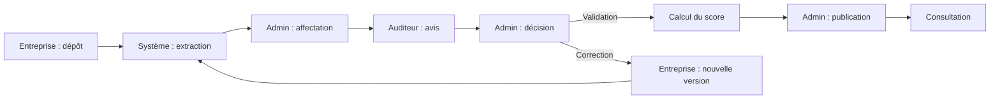

## A. STRATÉGIE GÉNÉRALE DE LA SOUTENANCE

**Proposition : 18 slides, 19 min 30 d’exposé, dont 2 minutes de démonstration, et 30 secondes de marge sur un créneau de 20 minutes hors questions.** La durée officielle n’étant pas précisée, ce calibrage est une hypothèse de préparation. Les identités, l’établissement et l’encadrement restent à compléter.

**Fil directeur : « Du rapport ESG à un score vérifiable : retrouver la source, contrôler la donnée, expliciter le calcul. »**

Document préparé à partir du dépôt examiné le 24 septembre 2026 : rapports techniques des étapes 1 à 3, documentation, code actuel, artefacts d’évaluation et supports existants. Il propose une nouvelle structure ; les anciens PowerPoint ne sont pas modifiés. Le dépôt contient plusieurs générations de documentation : le code et les résultats enregistrés priment pour décrire l’état actuel. Aucun benchmark IA distant ni parcours complet en base n’a été relancé pendant cette préparation.

### Analyse préalable du projet

| Dimension | Conclusion utile pour le jury |
| --- | --- |
| Domaine | Exploitation de rapports environnementaux, sociaux et de gouvernance — ESG — pour l’analyse d’entreprises et de portefeuilles. |
| Problématique centrale | Comment transformer des informations documentaires hétérogènes en données et scores consultables, tout en conservant leurs sources et un contrôle humain ? |
| Objectif général | Relier le document, les données extraites, leur revue et le score dans une même application. |
| Objectifs spécifiques | Structurer les PDF ; retrouver les passages pertinents ; extraire des valeurs avec leurs métadonnées ; produire les pages justificatives ; organiser audit, correction et publication ; calculer des scores selon des règles explicites. |
| Acteurs | Entreprise, auditeur, administrateur et investisseur portent le parcours principal. Chercheur et institution complètent les usages d’analyse et de collaboration. |
| Workflow | Dépôt → extraction → affectation → avis d’audit → décision administrative et calcul du score → publication → consultation. Une demande de correction ouvre une nouvelle version. |
| Architecture | Frontend React/TypeScript ; monolithe modulaire FastAPI ; PostgreSQL/SQLModel ; stockage local des PDF ; Redis pour des fonctions de sécurité ; extraction déclenchée avec BackgroundTasks. |
| Méthodes | Structuration Docling/OCR ; représentations BGE-M3 et recherche FAISS en mémoire ; extraction Gemini contrainte par un schéma ; normalisation bornée et moyennes pondérées pour le scoring. |
| Fonctionnalités majeures | Données reliées aux preuves, revue humaine, cycle de correction, scoring ESG, comparaison et agrégation des scores d’un portefeuille. |
| Résultats documentés | Pilote de 3 documents, 343 pages et 267 tableaux structurés ; 11 indicateurs sur 15 dont la page attendue figure dans les 8 premières pages du classement historique. |
| Contribution | Intégration d’une chaîne documentaire et métier traçable, avec un calcul explicite et des responsabilités séparées. Aucune nouvelle famille de modèles IA n’est revendiquée. |
| Frontières actuelles | Corpus restreint ; précision complète d’extraction non établie ; normalisation non calibrée sectoriellement ; traitement local ; moteurs PCAF et explicabilité avancée non implémentés. |

### Positionnement à défendre

Le projet est une **plateforme d’aide à l’analyse ESG fondée sur des preuves documentaires**. L’intelligence artificielle aide à retrouver et extraire l’information. Le score est calculé par des règles déterministes. L’auditeur émet un avis ; l’administrateur prend la décision et publie.

La présentation doit distinguer trois niveaux de preuve :

- **Implémenté dans le code** : une fonctionnalité dispose d’un chemin applicatif identifiable.
- **Mesuré sur un périmètre précis** : un résultat est associé à un corpus, une méthode et un artefact.
- **À développer ou à valider** : l’objectif existe, mais sa réalisation ou sa performance n’est pas établie.

Le jury doit voir le problème, le parcours, trois schémas utiles, un calcul simple, une démonstration et des résultats interprétés. Le rapport et les annexes conservent le schéma relationnel complet, toutes les routes, l’inventaire des bibliothèques, le détail des permissions et les configurations.

**Corrections indispensables par rapport aux anciens supports :** le scoring est désormais codé ; PCAF reste une perspective ; Redis n’exécute pas l’extraction ; pgvector n’est pas le moteur de recherche actif ; les captures existantes portent la mention « MODE PROTOTYPE » ; 73,3 % est un rappel documentaire historique, jamais une précision globale de l’IA. L’absence de licence repérée empêche également de présenter le statut open source comme établi.

## B. STRUCTURE GLOBALE

**E = essentielle ; S = secondaire, à présenter rapidement.** Les temps incluent les transitions.

| N° | Slide | Objectif | Temps |
| --- | --- | --- | --- |
| 1 — S | GreenFinance-Scorer : du rapport au score vérifiable | Installer la promesse et l’équipe | 0:30 |
| 2 — E | Une donnée publiée reste difficile à exploiter | Faire comprendre le besoin | 1:00 |
| 3 — S | Comparer exige une source et une méthode | Exposer les limites des approches partielles | 0:45 |
| 4 — E | Relier chaque résultat à son origine | Définir solution et objectifs | 0:55 |
| 5 — E | La publication résulte d’un contrôle partagé | Expliquer acteurs et workflow | 1:15 |
| 6 — E | Une architecture modulaire au service du parcours | Justifier les composants et les technologies | 1:15 |
| 7 — E | L’IA recherche et extrait ; l’humain vérifie | Expliquer le pipeline documentaire | 1:40 |
| 8 — E | Un score calculé par des règles explicites | Expliquer normalisation, poids et données manquantes | 1:40 |
| 9 — S | Valider séparément chaque maillon | Présenter la méthode de réalisation et d’évaluation | 1:00 |
| 10 — S | Des espaces adaptés à une même donnée | Montrer les interfaces utiles | 0:40 |
| 11 — E | Démonstration : du chiffre à sa preuve | Rendre la valeur observable | 2:00 |
| 12 — E | Le pilote a structuré 343 pages | Présenter le corpus et le résultat documentaire | 1:00 |
| 13 — E | 11 indicateurs sur 15 retrouvés dans le top 8 | Interpréter le rappel et ses échecs | 1:30 |
| 14 — E | Des tests ciblés, une validation à plusieurs niveaux | Délimiter les garanties obtenues | 1:10 |
| 15 — E | Notre contribution : relier preuve, contrôle et calcul | Répondre à « qu’avez-vous apporté ? » | 0:55 |
| 16 — E | Les limites indiquent où renforcer le système | Exposer les frontières actuelles | 1:00 |
| 17 — S | Priorité : mesurer, calibrer, industrialiser | Donner des perspectives réalistes | 0:40 |
| 18 — E | Rendre le score vérifiable pour mieux l’utiliser | Répondre à la problématique et ouvrir les questions | 0:35 |
| **Total** | **18 slides** | **Exposé + démonstration** | **19:30** |

Repères : slide 5 terminée à 4:25 ; slide 9 à 10:00 ; démonstration terminée à 12:40 ; slide 14 à 16:20 ; fin à 19:30. Les 30 secondes restantes absorbent un changement de présentateur ou un léger retard.

**Si le créneau officiel est de 15 minutes :** fusionner 2–3 et 16–17 ; passer 9 et 10 en annexe ; limiter la démonstration à 90 secondes ; viser 14:30 après répétition. Conserver les résultats, le calcul et la contribution. Si 25 minutes sont disponibles, consacrer le temps supplémentaire à une preuve détaillée, à un exemple de score et aux questions techniques, sans ajouter de catalogue de fonctionnalités.

## C. DÉTAIL SLIDE PAR SLIDE

### Slide 1 — GreenFinance-Scorer : du rapport au score vérifiable

**1. Objectif.** Faire comprendre immédiatement le sujet et identifier l’équipe.

**2. À afficher.** Titre ci-dessus. Sous-titre : « Plateforme d’analyse ESG avec preuves documentaires et validation humaine ». Puis `[Prénoms et noms]`, `[Formation — établissement]`, `[Encadrant(s)]`, `[Date]`.

**3. Mots-clés.** ESG · documents · score · preuve.

**4. Message principal.** La valeur d’un score dépend aussi de la possibilité de le vérifier.

**5. À expliquer oralement.** « Bonjour Mesdames et Messieurs les membres du jury. Nous sommes [noms]. Notre projet répond à une question simple : comment passer d’un rapport d’entreprise à un score dont on peut retrouver les sources et expliquer le calcul ? »

**6. Visuel recommandé.** Une ligne PDF → donnée sourcée → score. Couverture minimaliste, logos institutionnels discrets. Éviter les arbres, planètes et logos technologiques décoratifs qui rendent le domaine moins précis.

**7. Transition.** « Cette question vient d’une difficulté très concrète dans l’exploitation des rapports. »

**8. Temps.** 30 secondes — secondaire.

### Slide 2 — Une donnée publiée reste difficile à exploiter

**1. Objectif.** Expliquer ESG et rendre le problème accessible à un non-spécialiste.

**2. À afficher.** « ESG = Environnement, Social, Gouvernance ». Trois difficultés : « Formats hétérogènes », « Unités et périodes différentes », « Sources à retrouver ». Bandeau : « Besoin : comparer sans perdre le contexte ».

**3. Mots-clés.** Hétérogénéité · unités · période · périmètre · comparaison.

**4. Message principal.** La présence d’un chiffre dans un PDF ne suffit pas à le rendre exploitable.

**5. À expliquer oralement.** « Une émission annuelle en tonnes et une intensité par kilowattheure décrivent deux choses différentes. Il faut retrouver le chiffre, mais aussi son unité, sa période et son périmètre avant de le comparer. Ce travail concerne l’entreprise, l’auditeur et l’investisseur. »

**6. Visuel recommandé.** Deux extraits documentaires annotés : valeur, unité, année. Employer un exemple pédagogique ou des extraits autorisés et sourcés. Éviter les statistiques de marché sans source et les chiffres de gain de temps non mesurés.

**7. Transition.** « Les approches qui traitent seulement une partie du problème laissent ces vérifications à l’utilisateur. »

**8. Temps.** 1 minute — essentielle.

### Slide 3 — Comparer exige une source et une méthode

**1. Objectif.** Montrer les limites auxquelles répond le projet, sans inventer une étude concurrentielle.

**2. À afficher.** Un tableau de trois lignes : « Lecture manuelle seule → collecte à répéter » ; « Extraction seule → contexte à contrôler » ; « Score seul → méthode à expliciter ». Conclusion : « Relier collecte, preuve et calcul ».

**3. Mots-clés.** Collecte · contrôle · méthode · traçabilité.

**4. Message principal.** La chaîne complète doit conserver les liens entre ses étapes.

**5. À expliquer oralement.** « Il ne s’agit pas de prétendre que toutes les solutions existantes sont opaques. Notre besoin est de réunir, dans un même parcours, la donnée extraite, sa preuve, sa validation et la règle de calcul. C’est ce périmètre que nous avons choisi de traiter. »

**6. Visuel recommandé.** Tableau conceptuel « approche / point restant à traiter ». Éviter logos de concurrents, étoiles et coches suggérant un benchmark non réalisé.

**7. Transition.** « GreenFinance-Scorer organise précisément cette continuité. »

**8. Temps.** 45 secondes — secondaire.

### Slide 4 — Relier chaque résultat à son origine

**1. Objectif.** Définir la solution et ses objectifs observables.

**2. À afficher.** « Document → données sourcées → revue → score → consultation ». Trois objectifs : « Structurer », « Vérifier », « Calculer explicitement ». Petit libellé : « Scores ESG et données carbone rapportées ».

**3. Mots-clés.** Source · extraction · revue · scoring · consultation.

**4. Message principal.** Le produit relie les étapes nécessaires à l’interprétation d’un score.

**5. À expliquer oralement.** « Nous conservons le document et produisons des données accompagnées de preuves. Un circuit humain contrôle le rapport avant sa publication. Le score repose ensuite sur une configuration explicite. Les émissions présentes dans les rapports sont extraites ; le calcul des émissions financées constitue une extension future. »

**6. Visuel recommandé.** Cinq blocs avec une ligne secondaire reliant « score » à « règle » et « donnée » à « page ». Éviter d’ajouter toutes les fonctionnalités ou d’afficher PCAF comme livré.

**7. Transition.** « Ce parcours repose sur une répartition précise des responsabilités. »

**8. Temps.** 55 secondes — essentielle.

### Slide 5 — La publication résulte d’un contrôle partagé

**1. Objectif.** Faire comprendre qui fournit, vérifie, décide et consulte.

**2. À afficher.** « Entreprise : dépôt / correction » ; « Système : extraction » ; « Administrateur : affectation » ; « Auditeur : avis » ; « Administrateur : validation, score, publication » ; « Investisseur : consultation ». En marge : « Chercheur + institution : analyses et projets ».

**3. Mots-clés.** Rôles · affectation · avis · correction · publication.

**4. Message principal.** L’extraction automatique s’inscrit dans un processus de responsabilité humaine.

**5. À expliquer oralement.** « L’auditeur examine le rapport et les preuves, puis soumet un avis. L’administrateur décide de valider, rejeter ou demander une correction. La validation déclenche le calcul ; la publication est une action distincte. Une correction conserve le lien avec la version précédente. »

**6. Visuel recommandé.** Workflow en couloirs, avec une seule boucle de correction. Il est utile pour expliquer la séparation avis/décision. Supprimer notifications, profils, invitations et tous les états secondaires ; ne pas transformer la slide en diagramme de cas d’utilisation exhaustif.

**7. Transition.** « L’architecture traduit cette séparation des responsabilités. »

**8. Temps.** 1 minute 15 — essentielle.

### Slide 6 — Une architecture modulaire au service du parcours

**1. Objectif.** Expliquer les composants réels et justifier les choix essentiels.

**2. À afficher.** Quatre niveaux : « React / TypeScript » → « API FastAPI : contrats + permissions » → « Modules métier + pipeline documentaire » → « PostgreSQL + stockage PDF ». À côté : « Redis : sessions et limitation » ; « Gemini : service externe ». Mention : « Monolithe modulaire ».

**3. Mots-clés.** React · FastAPI · PostgreSQL · modules · permissions · stockage.

**4. Message principal.** Une application backend modulaire réunit les responsabilités tout en gardant des frontières claires.

**5. À expliquer oralement.** « React construit les espaces par rôle. FastAPI centralise les contrats et les autorisations. PostgreSQL relie les données métier et les PDF sont conservés dans un stockage local. Le traitement documentaire démarre en arrière-plan dans le serveur. Gemini est une dépendance externe ; Redis intervient dans la sécurité. »

**6. Visuel recommandé.** Schéma de déploiement simplifié, base et fichiers distincts, frontière visible autour du service IA externe. Montrer les échanges indispensables. Éviter un dessin de microservices, des workers distribués inexistants, pgvector comme recherche active ou une slide entière de logos.

**7. Transition.** « Regardons maintenant ce qui se passe à l’intérieur du traitement documentaire. »

**8. Temps.** 1 minute 15 — essentielle.

### Slide 7 — L’IA recherche et extrait ; l’humain vérifie

**1. Objectif.** Rendre le pipeline compréhensible et situer les risques d’erreur.

**2. À afficher.** « PDF → Docling / OCR → recherche BGE-M3 / FAISS → extraction Gemini → données + pages justificatives ». Sous la sortie : « valeur • unité • période • page ». Bandeau : « Revue humaine avant publication ».

**3. Mots-clés.** OCR · recherche sémantique · extraction structurée · provenance · revue.

**4. Message principal.** Chaque outil remplit une étape différente ; un format JSON valide ne garantit pas un chiffre exact.

**5. À expliquer oralement.** « Docling structure le document. BGE-M3 et FAISS aident à retrouver les passages liés à un indicateur. Gemini propose une extraction structurée, puis une page justificative est produite. La version actuelle élargit la recherche sous budget de contexte et peut relancer les indicateurs manquants. Ces mécanismes réduisent certains risques, mais leur précision complète reste à mesurer. »

**6. Visuel recommandé.** Pipeline de cinq blocs et une carte de donnée reliée à une page. Montrer pourquoi la recherche précède l’extraction. Supprimer détails de tokenisation, appels internes et champs du JSON. Réserver les numéros de modèle à l’annexe d’environnement.

**7. Transition.** « Une fois la donnée disponible, le calcul du score suit une logique différente et explicite. »

**8. Temps.** 1 minute 40 — essentielle.

### Slide 8 — Un score calculé par des règles explicites

**1. Objectif.** Expliquer le calcul et ses hypothèses sans lui attribuer une validation scientifique inexistante.

**2. À afficher.** « Valeur brute → note 0–100 → score du pilier → score global ». Formule : « Score = 0,50 E + 0,25 S + 0,25 G* ». Exemple pédagogique : « 25 % de femmes managers ; bornes 0–50 % → sous-note 50/100 ». Pied lisible : « *Si les trois piliers sont disponibles. Données absentes : poids renormalisés. »

**3. Mots-clés.** Normalisation · pondération · configuration · données manquantes · calibration.

**4. Message principal.** Le score est explicable, mais il dépend de conventions méthodologiques à valider.

**5. À expliquer oralement.** « Le modèle génératif n’attribue pas la note. Nous normalisons les indicateurs, puis appliquons des moyennes pondérées. La configuration actuelle utilise six indicateurs : trois environnementaux, deux sociaux et un de gouvernance. Une valeur absente est exclue et les poids sont renormalisés ; si rien n’est calculable, le score est refusé. Les bornes restent un premier choix méthodologique, à calibrer par secteur. »

**6. Visuel recommandé.** Une jauge 0–100, un exemple et les trois poids. Mettre la formule générale en annexe. Éviter de confondre un score déclaré par l’entreprise avec le score calculé, d’afficher les poids fictifs du prototype ou d’interpréter « 82/100 » comme une certification.

**7. Transition.** « Pour évaluer cette chaîne, nous avons besoin de vérifier ses maillons séparément. »

**8. Temps.** 1 minute 40 — essentielle.

### Slide 9 — Valider séparément chaque maillon

**1. Objectif.** Présenter une démarche d’ingénierie et d’évaluation adaptée aux risques.

**2. À afficher.** « Besoin et rôles → modèle de données → pilote documentaire → intégration métier → tests ». Deux familles de données : « 3 documents réels : recherche documentaire » ; « 6 scénarios synthétiques : cas de workflow préparés ». Puis : « Tests logiciels : calculs, contrats et accès ».

**3. Mots-clés.** Itération · vérité terrain · corpus · scénarios · validation.

**4. Message principal.** Des preuves différentes répondent à des questions différentes.

**5. À expliquer oralement.** « Les rapports techniques documentent le cadrage, le socle et les données. Le dépôt contient ensuite le pilote et l’intégration. Les documents réels servent à examiner la difficulté documentaire ; les scénarios synthétiques rendent les cas métier contrôlables. Leur présence ne suffit pas à annoncer que tous les parcours ont été exécutés avec succès. »

**6. Visuel recommandé.** Frise des étapes et deux types de corpus. Éviter un calendrier inventé, une revendication Scrum sans traces de sprints ou un diagramme ML d’entraînement : les modèles utilisés sont préentraînés.

**7. Transition.** « Cette démarche se traduit dans les espaces que nous avons développés. »

**8. Temps.** 1 minute — secondaire.

### Slide 10 — Des espaces adaptés à une même donnée

**1. Objectif.** Donner une vue concrète du produit avant la démonstration.

**2. À afficher.** Trois usages : « Entreprise : suivre le rapport » ; « Auditeur : vérifier les preuves » ; « Investisseur : consulter et comparer ». Mention discrète : « Administration, recherche et institution complètent le parcours ».

**3. Mots-clés.** Interface · rapport · preuve · comparaison.

**4. Message principal.** Chaque rôle reçoit les informations et actions utiles à sa responsabilité.

**5. À expliquer oralement.** « Nous présentons trois espaces pour suivre une même donnée. Le premier montre son origine, le deuxième son contrôle et le troisième son utilisation. Les autres espaces organisent la gestion et les analyses complémentaires. »

**6. Visuel recommandé.** Trois recadrages lisibles d’écrans applicatifs réels. Si les images de `presentation_assets/` sont utilisées, conserver ou ajouter « Prototype — données simulées ». Éviter une mosaïque des six tableaux de bord et toute capture dont les chiffres contredisent la configuration réelle.

**7. Transition.** « Suivons maintenant un indicateur, depuis le rapport jusqu’à sa consultation. »

**8. Temps.** 40 secondes — secondaire.

### Slide 11 — Démonstration : du chiffre à sa preuve

**1. Objectif.** Prouver l’utilité du parcours sur un exemple préparé.

**2. À afficher.** « 1. Rapport et donnée → 2. Page justificative → 3. Décision et score → 4. Consultation ». Sous-titre : « Scénario synthétique préparé : Nordwind Energie ». Mention : « Extraction exécutée en amont », uniquement si cela a été effectivement fait.

**3. Mots-clés.** Rapport · preuve · décision · score · consultation.

**4. Message principal.** L’utilisateur peut remonter du résultat à l’élément qui le justifie.

**5. À expliquer oralement.** « Ce dossier utilise une entreprise fictive pour rendre le parcours facile à vérifier. Voici la valeur, son unité et sa page. Voici ensuite l’avis et la décision administrative. Nous retrouvons enfin le résultat publié dans l’espace de consultation. » Adapter la dernière phrase au statut réellement montré ; ne pas annoncer une action non exécutée.

**6. Visuel recommandé.** Application préparée ou vidéo de 120 secondes au maximum. Voir section E pour le minutage. Éviter connexion, création de compte, attente OCR et navigation improvisée. Ne pas utiliser le sélecteur de rôle du prototype comme preuve d’authentification.

**7. Transition.** « Ce parcours montre l’usage ; examinons maintenant ce que les mesures permettent d’affirmer. »

**8. Temps.** 2 minutes — essentielle, durée maximale.

### Slide 12 — Le pilote a structuré 343 pages

**1. Objectif.** Donner un résultat documentaire concret et son périmètre.

**2. À afficher.** Trois chiffres : « 3 documents », « 343 pages », « 267 tableaux ». Trois lignes : « Microsoft : 25 pages / 28 tableaux » ; « Ørsted : 218 / 166 » ; « Ingka Group : 100 / 73 ». Note : « Comptage des pages concordant avec PyMuPDF pour les 3 documents ».

**3. Mots-clés.** Corpus pilote · structuration · pages · tableaux · contrôle.

**4. Message principal.** La structuration a été exécutée sur un corpus réel identifié.

**5. À expliquer oralement.** « Ces chiffres viennent des résultats enregistrés du pilote. Le document Microsoft est une fiche de données environnementales. Le comptage des pages concorde avec un second lecteur PDF. Cela démontre la conversion et son volume ; cela ne valide pas chaque cellule de chaque tableau. »

**6. Visuel recommandé.** Trois barres de pages et trois nombres de tableaux, ou trois cartes de documents. Source en pied : `prompt_4_2_structuration.json`. Éviter « 267 tableaux parfaitement extraits » ou une animation suggérant un traitement instantané. Les durées historiques sont en annexe.

**7. Transition.** « Après avoir structuré le document, il faut encore retrouver les pages qui contiennent la bonne information. »

**8. Temps.** 1 minute — essentielle.

### Slide 13 — 11 indicateurs sur 15 retrouvés dans le top 8

**1. Objectif.** Présenter le résultat de recherche et expliquer un échec utile.

**2. À afficher.** « Rappel documentaire @8 : 11/15 = 73,3 % ». Barres : « Microsoft : 0/4 » ; « Ørsted : 7/7 » ; « Ingka Group : 4/4 ». Annotation : « Microsoft : page attendue au rang 10 ». Mention : « Benchmark historique de recherche ; exactitude d’extraction non mesurée ici ».

**3. Mots-clés.** Rappel · top 8 · classement · page attendue · évaluation.

**4. Message principal.** Le benchmark révèle un résultat partiel et un défaut précis de sélection documentaire.

**5. À expliquer oralement.** « Un succès signifie que la page attendue pour l’indicateur figure parmi les huit premières pages retenues. Onze indicateurs sur quinze satisfont ce critère. Chez Microsoft, les quatre indicateurs partagent une page qui arrive au rang dix. La version actuelle a fait évoluer la sélection, mais un nouveau benchmark comparable est nécessaire pour mesurer son effet. »

**6. Visuel recommandé.** Barres horizontales avec fractions et dénominateurs. Les quatre échecs Microsoft ne représentent pas quatre erreurs indépendantes : l’expliquer oralement. Éviter une jauge « fiabilité IA 73 % », un résultat top 10 présenté comme validé ou une confusion entre le protocole ancien et le pipeline actuel.

**7. Transition.** « Cette mesure documentaire doit être complétée par la validation du calcul et du logiciel. »

**8. Temps.** 1 minute 30 — essentielle.

### Slide 14 — Des tests ciblés, une validation à plusieurs niveaux

**1. Objectif.** Montrer des preuves de qualité tout en délimitant leur portée.

**2. À afficher.** « Calcul/configuration : 15 tests réussis ». Puis trois niveaux : « Recherche : résultat archivé » ; « Logiciel : tests ciblés exécutés » ; « Extraction complète et charge : à mesurer ». Si une exécution frontend est confirmée, l’ajouter avec son périmètre exact, sans remplacer les réserves.

**3. Mots-clés.** Tests · normalisation · configuration · périmètre · reproductibilité.

**4. Message principal.** La validation est établie composant par composant, avec des frontières identifiées.

**5. À expliquer oralement.** « Lors de cette préparation, quinze tests de normalisation et de configuration ont réussi. Ils vérifient notamment les bornes et la cohérence des poids. Ils ne remplacent ni les tests d’intégration en base ni une mesure de précision du modèle sur des rapports réels. Nous conservons cette distinction dans nos conclusions. »

**6. Visuel recommandé.** Matrice courte « vérification / preuve / portée ». Le détail des commandes reste en annexe. Éviter capture de console illisible, nombre total de tests non exécutés, couverture ou CI verte non vérifiée.

**7. Transition.** « Ces éléments permettent de préciser ce que notre travail apporte réellement. »

**8. Temps.** 1 minute 10 — essentielle.

### Slide 15 — Notre contribution : relier preuve, contrôle et calcul

**1. Objectif.** Rendre la contribution propre de l’équipe identifiable.

**2. À afficher.** « Technique : pipeline intégré à l’application » ; « Fonctionnelle : circuit de revue et de correction » ; « Méthodologique : calcul explicite + évaluation documentée ». Bandeau : « Une donnée peut être reliée à sa source et à son usage ».

**3. Mots-clés.** Intégration · traçabilité · responsabilité · méthode · contribution.

**4. Message principal.** L’apport principal est une intégration d’ingénierie vérifiable.

**5. À expliquer oralement.** « Notre travail assemble les outils documentaires, le modèle de données, les preuves, les décisions et les scores dans un parcours cohérent. Les modèles IA sont préentraînés. La contribution scientifique tient à l’explicitation du protocole et à l’analyse de ses résultats ; nous ne revendiquons pas un nouvel algorithme ni une notation certifiée. »

**6. Visuel recommandé.** Trois cartes contribution/preuve : pipeline et entités ; états et écrans ; configuration et benchmark. Éviter « premier système », « révolutionnaire », « prêt à grande échelle » ou « open source » sans licence établie. L’adaptation MRU peut être mentionnée en annexe sans revendiquer un impact national mesuré.

**7. Transition.** « Cette contribution a un périmètre actuel qu’il faut également rendre clair. »

**8. Temps.** 55 secondes — essentielle.

### Slide 16 — Les limites indiquent où renforcer le système

**1. Objectif.** Présenter les limites comme des résultats d’analyse et des priorités.

**2. À afficher.** Trois couples : « Corpus restreint → évaluation élargie » ; « Bornes et indicateurs génériques → calibration sectorielle » ; « Traitement local / dépendance IA externe → robustesse et maîtrise des données ». Pied : « PCAF et explicabilité avancée : extensions non livrées ».

**3. Mots-clés.** Généralisation · calibration · robustesse · dépendance · périmètre.

**4. Message principal.** Le prototype applicatif prouve une approche, sans établir encore sa validité générale ni son exploitation à grande échelle.

**5. À expliquer oralement.** « Trois documents ne représentent pas la diversité des rapports ESG. Les poids et les bornes ne constituent pas un référentiel sectoriel validé. Les absences peuvent modifier la composition d’un score. Enfin, la latence, la dépendance au fournisseur et les traitements en arrière-plan doivent être éprouvés avant une exploitation plus large. »

**6. Visuel recommandé.** Trois lignes limite → action et un encart de périmètre. Éviter d’attribuer toutes les limites à l’environnement ; certaines concernent bien les fonctionnalités et la méthodologie du projet.

**7. Transition.** « Nous proposons donc une suite de travail ordonnée par les preuves à obtenir. »

**8. Temps.** 1 minute — essentielle.

### Slide 17 — Priorité : mesurer, calibrer, industrialiser

**1. Objectif.** Montrer une trajectoire réaliste avec des critères de réussite.

**2. À afficher.** « 1. Mesurer : valeur + unité + période + page » ; « 2. Calibrer : secteurs + données manquantes » ; « 3. Industrialiser : reprise + file durable + charge ». En perspective suivante : « Étudier puis valider le calcul PCAF ».

**3. Mots-clés.** Protocole · calibration · reprise · charge · extension.

**4. Message principal.** Les extensions doivent suivre une consolidation mesurable du socle.

**5. À expliquer oralement.** « Nous commencerions par un corpus élargi et annoté, puis par l’évaluation complète de l’extraction. Ensuite viendraient la calibration métier et la robustesse d’exécution. Les émissions financées exigent leurs propres données, règles et tests ; elles constituent donc un chantier distinct. »

**6. Visuel recommandé.** Trois horizons sans dates inventées ; associer à chacun un livrable vérifiable. Éviter une liste de technologies sans lien avec les limites.

**7. Transition.** « Nous pouvons maintenant répondre à la question posée au début. »

**8. Temps.** 40 secondes — secondaire.

### Slide 18 — Rendre le score vérifiable pour mieux l’utiliser

**1. Objectif.** Fermer le récit sur le résultat et la valeur, puis ouvrir l’échange.

**2. À afficher.** « Rapports hétérogènes → données sourcées → revue humaine → calcul explicite ». Résultat en petit : « Pipeline intégré ; pilote documentaire évalué ». Phrase finale : « Un score utile doit pouvoir être expliqué et vérifié. »

**3. Mots-clés.** Source · contrôle · calcul · confiance.

**4. Message principal.** La contribution est de rendre l’analyse plus vérifiable, avec des performances et un périmètre explicités.

**5. À expliquer oralement.** « Nous sommes partis de rapports difficiles à exploiter. Nous avons relié extraction, preuves, revue humaine et scoring dans une même application, puis évalué plusieurs maillons de cette chaîne. Un score utile doit pouvoir être expliqué et vérifié. Merci pour votre attention. Nous sommes disponibles pour vos questions. »

**6. Visuel recommandé.** Une phrase forte et quatre étapes. Éviter une répétition du sommaire, de nouveaux chiffres ou une dernière slide réduite à “Merci” qui efface le message.

**7. Transition.** « Nous pouvons revenir sur la méthode de calcul, les preuves ou les résultats selon vos questions. »

**8. Temps.** 35 secondes — essentielle.

## D. SLIDES DE SECOURS / ANNEXES

Préparer les annexes après la conclusion, numérotées A1 à A8. Elles ne font pas partie des 19 min 30. Les afficher seulement lorsqu’une question le justifie.

| Annexe | Objectif et contenu à afficher | Message / mots-clés | Oral, visuel et transition | Temps si appelée |
| --- | --- | --- | --- | --- |
| A1 — Calcul détaillé | Normalisation, moyenne pondérée, cas manquants et exemple Nordwind ci-dessous. | Une note dépend de règles explicites. Normalisation, poids, couverture. | « Voici les étapes du calcul sur des valeurs synthétiques connues. » Tableau limité à E/S/G ; éviter tout le YAML. Retour : « Cela explique la note de la slide 8. » | 60–90 s |
| A2 — Protocole de recherche | Définition du rappel, 3 documents, 15 cibles, top 8, rang 10 Microsoft. | La mesure porte sur le classement des pages. Corpus, cible, rappel. | « Une cible réussit si sa page attendue est sélectionnée. » Un classement annoté ; éviter les 343 pages. Retour vers résultats. | 45–60 s |
| A3 — Performances historiques | Tableau des temps de conversion enregistré ci-dessous. | La latence reste une limite mesurée sur ce pilote. Temps, environnement, répétitions. | « Ce sont des durées historiques de structuration, pas une mesure actuelle de bout en bout. » Barres à échelle explicite ; pas de promesse temps réel. Retour vers limites. | 45 s |
| A4 — Données et provenance | Entreprise → Rapport → Indicateur → Preuve ; Rapport → Score → Configuration. | Les relations permettent de remonter à l’origine. Entités, preuve, configuration. | « Nous relions les objets sans recopier une valeur dans chaque espace. » Six boîtes sans liste d’attributs ; éviter le modèle complet. Retour vers architecture. | 60 s |
| A5 — Sécurité et accès | Session, rôle, propriété/affectation de la ressource, CSRF, validation PDF. | Le rôle seul ne suffit pas à autoriser une ressource. Session, rôle, périmètre. | « Le serveur vérifie aussi le droit d’accès à ce dossier précis. » Trois contrôles et un exemple ; aucun secret affiché. Retour vers workflow. | 60 s |
| A6 — Séquence dépôt et traitement | Navigateur → API → enregistrement → BackgroundTasks → résultat persisté. | Le traitement long est déclenché après le dépôt. API, tâche, état. | « L’accusé de dépôt et la fin d’extraction sont deux événements distincts. » Cinq participants maximum ; éviter les appels de bibliothèque. Retour vers architecture. | 45–60 s |
| A7 — Résultats logiciels et objectifs | Commandes, périmètres, date, résultats disponibles ; matrice objectifs/preuves ci-dessous. | Une preuve est liée à son périmètre. Test, mesure, traçabilité. | « Voici ce qui a été exécuté et ce qui reste à mesurer. » Tableau lisible ; pas de capture de terminal dense. Retour vers validation. | 60 s |
| A8 — Contributions individuelles | `[Membre] / réalisation personnelle / preuve / travail partagé`. | Le travail d’équipe conserve des responsabilités identifiables. Contribution, preuve, collaboration. | « J’ai pris en charge [X], vérifiable dans [Y] ; nous avons revu [Z] ensemble. » 3–4 lignes ; aucune répartition inventée. Retour vers contribution. | 45–60 s |

### A1 — Exemple de calcul vérifiable

Pour un indicateur croissant, avec `a` et `b` les bornes configurées :

`n(x) = 100 × min(1, max(0, (x − a) / (b − a)))`.

Pour un indicateur décroissant : `n(x) = 100 − n_croissant(x)`.

Pour les indicateurs présents `I` d’un pilier : `P = Σ(wᵢ × nᵢ) / Σ(wᵢ)`. Même renormalisation entre les piliers disponibles. Un pilier sans donnée reste non calculé ; aucun score global n’est produit si tous sont absents. L’absence ne doit pas être affichée comme une note zéro.

**Exemple recalculé lors de cette préparation, à partir des valeurs attendues du scénario synthétique Nordwind et du fichier de configuration, sans extraction IA exécutée :**

| Pilier | Sous-notes et poids | Résultat |
| --- | --- | --- |
| E | 94 × 0,34 + 71 × 0,33 + 93,8 × 0,33 | 86,344 |
| S | 56 × 0,60 + 80 × 0,40 | 65,6 |
| G | 90 × 1 | 90 |
| Global | 86,344 × 0,50 + 65,6 × 0,25 + 90 × 0,25 | **82,072**, soit **82,07/100** |

Sources : `data_test/reference_e2e/nordwind_energie/scenario.json`, `config/weights/default.yaml`, `app/scoring/normalization.py`. Ce résultat illustre la formule ; il n’atteste pas que le même dossier a été extrait et publié dans la base active. L’exemple synthétique ne doit pas servir à valider la cohérence physique des indicateurs carbone.

### A3 — Durées présentes dans les artefacts

| Document pilote | Pages | Durée de structuration enregistrée | Lecture correcte |
| --- | --- | --- | --- |
| Microsoft | 25 | 484,2 s, soit environ 8 min 04 | Une exécution historique |
| Ørsted | 218 | 3 619,6 s, soit environ 1 h 00 min 20 | Une exécution historique |
| Ingka Group | 100 | 17 748,7 s, soit environ 4 h 55 min 49 | Une exécution historique |

Source : `data_test/prompt_4_2_structuration.json`. Ne pas réduire ces durées à une moyenne présentée comme un débit garanti. Sans environnement et répétitions comparables, on ne peut pas attribuer l’écart au seul nombre de pages. Aucune latence actuelle bout en bout, capacité concurrente ou réduction de temps face à un humain n’est établie par ce fichier.

### Choix des diagrammes

| Diagramme envisagé | Décision | Utilité et simplification |
| --- | --- | --- |
| Cas d’utilisation complet | Annexe facultative, remplacé dans le récit par le workflow | Utile pour des questions de périmètre ; garder les acteurs et 6 actions majeures, supprimer la liste des opérations CRUD. |
| Architecture générale + frontend/backend | Slide 6, fusionnés en un seul schéma | Montrer responsabilités, données et dépendance externe ; supprimer versions de paquets, ports et arborescence. |
| Workflow fonctionnel | Slide 5 | Montrer qui décide et la boucle de correction ; supprimer événements secondaires. |
| Pipeline IA | Slide 7 | Distinguer structuration, recherche et extraction ; aucun faux étage d’entraînement de modèle. |
| Processus de scoring | Slide 8 | Montrer passage valeur → sous-note → pilier → global ; formule complète en A1. |
| Séquence | A6 | Répondre à la question de l’asynchronisme ; ne pas doubler le workflow dans le récit principal. |
| Modèle de données | A4 | Montrer la provenance ; garder seulement les six entités structurantes. |

Schéma d’architecture proposé, à redessiner avec de grands libellés dans le support :



Pipeline documentaire proposé :



Workflow proposé :



Le workflow illustre le parcours principal de première publication ; il ne décrit pas toutes les règles de sélection des versions pour une entreprise déjà publiée. L’affectation, l’avis et la décision ne doivent pas être fusionnés en un unique bouton « IA valide ».

## E. STRATÉGIE DE DÉMONSTRATION

**La démonstration est pertinente à la slide 11**, après l’explication de la méthode et avant les résultats. Son objectif est de montrer qu’une valeur reste vérifiable dans un parcours métier.

Privilégier un dossier synthétique simple déjà traité, comme Nordwind Energie. La préparation doit distinguer un **PDF synthétique réellement extrait** d’une **sortie artificielle du mode démo** : la présence d’un scénario JSON ne prouve pas une exécution. Le code contient un mode de remplacement lorsque la clé Gemini est un marqueur ; ses données ne doivent pas être présentées comme extraites du PDF.

| Temps | Action à montrer | Formulation orale |
| --- | --- | --- |
| 0:00–0:20 | Ouvrir le rapport dans l’espace entreprise, montrer année et statut. | « Voici le document d’origine et le dossier auquel les données sont rattachées. » |
| 0:20–0:55 | Ouvrir une donnée puis la page justificative, depuis un dossier auditeur affecté. | « Nous contrôlons la valeur avec son unité, sa période et la page correspondante. » |
| 0:55–1:25 | Montrer l’avis, puis la décision administrative et le score, sur des états préparés. | « L’avis d’audit et la décision administrative sont distincts ; le score suit la méthode présentée. » |
| 1:25–1:50 | Montrer le résultat dans l’espace investisseur, avec accès à la source. | « L’utilisateur retrouve le résultat et peut revenir à la preuve. » |
| 1:50–2:00 | Revenir aux slides. | « Ce parcours montre l’usage. Passons maintenant aux mesures. » |

L’utilisation d’états préparés doit être annoncée : ne pas faire passer un changement d’onglet entre dossiers pour une transition réellement exécutée. Pour filmer un parcours complet, conserver les actions et leur ordre, puis couper explicitement les temps d’attente. Une capture de score préchargé n’atteste pas à elle seule le calcul backend.

**À préparer avant la soutenance :**

- Dossier, comptes autorisés et onglets déjà ouverts ; aucun secret ni compte personnel visible.
- PDF, indicateur et page concordants ; unités et période contrôlées ; résultat conforme à la configuration réellement utilisée.
- Vidéo locale facultative de 120 secondes maximum. Le dépôt contient un emplacement `demo_greenfinance.mp4` dans les anciens supports, mais aucune vidéo correspondante n’a été trouvée.
- Version PDF du support et captures hors ligne. Ne pas dépendre d’un téléchargement, d’un démarrage de modèle ou d’un appel IA pendant l’exposé.

**Captures de secours à produire sur le parcours connecté :**

1. Rapport déposé : entreprise, année, version et état visibles.
2. Indicateur contextualisé : valeur, unité, période et lien vers preuve.
3. Page PDF correspondante : valeur et contexte lisibles, numéro de page physique identifié.
4. Avis d’audit et décision administrative du même dossier.
5. Score calculé et vue investisseur, avec référence de configuration lorsque disponible.

Les images déjà présentes peuvent illustrer la conception : `docs/presentation_assets/company-results.png`, `audit-assignments.png`, `investor-compare.png`, `admin-dashboard.png`, `researcher-analyses.png`. Elles ne remplacent pas les cinq preuves ci-dessus. La capture `company-results.png` affiche notamment « MODE PROTOTYPE », des poids 40/30/30 et une version fictive v2.4, alors que la configuration réelle examinée est v1 avec 50/25/25. Ne pas mélanger ces chiffres.

**En cas de problème :** après 10 secondes maximum, afficher les captures et dire : « Je poursuis avec les captures du même parcours préparées pour la présentation. » Si seules des maquettes sont disponibles, dire « illustration du parcours », puis fonder la validation sur les artefacts mesurés. Ne pas déboguer devant le jury.

## F. RÈGLES DE DESIGN

| Élément | Prescription concrète |
| --- | --- |
| Format | 16:9 ; même grille et mêmes marges sur tout le support. |
| Palette | Fond blanc cassé `#F7F9F8` ; titres bleu nuit `#16324F` ; vert principal `#0F6B4F` ; texte secondaire gris `#5B6573` ; ambre `#B7791F` réservé aux limites. |
| Sémantique | Vert = résultat établi ; ambre = limite ou validation restante ; gris = contexte. Toujours associer une étiquette au code couleur. |
| Typographie | Aptos, Arial ou IBM Plex Sans si elle est disponible sur le poste et incorporable. Une seule famille, deux graisses. |
| Tailles | Titres 32–36 pt ; texte 24–28 pt ; légendes 18–20 pt ; références 12–14 pt minimum. Toute information essentielle doit être lisible sans la référence. |
| Quantité de texte | Viser 25–40 mots par slide, hors titre/source ; 3 idées maximum. Le script oral reste dans les notes. |
| Mise en page | Un visuel dominant ; espace libre d’environ un tiers ; alignement constant ; aucune décoration qui concurrence le message. |
| Icônes | Même famille, même épaisseur, une icône par concept ; pas d’icône décorative répétée sur chaque ligne. |
| Graphiques | Barres simples, axe et dénominateurs explicites ; pas de 3D ; afficher 0/4, 7/7 et 4/4 autant que les pourcentages. |
| Captures | Un écran ou quelques recadrages cohérents ; 2 annotations maximum ; conserver le statut réel et la mention prototype lorsqu’elle s’applique. |
| Diagrammes | 5–7 blocs majeurs, lecture gauche-droite ou haut-bas ; légendes courtes ; même forme pour la même catégorie. |
| Tableaux | 3–4 colonnes et 5 lignes maximum dans le récit ; les tableaux détaillés de ce guide vont en annexe ou dans les notes. |
| Animation | Apparition simple si elle guide la lecture ; sinon aucune. Transition uniforme, sans son, de 0 à 0,3 seconde. |
| Numérotation | 01/18 à 18/18 ; annexes A1–A8. |
| Pied de page | « GreenFinance-Scorer · Soutenance PFE » + source abrégée sur les slides de résultats. Aucune URL longue en texte principal. |
| Cohérence | Un seul style de titre affirmatif, une échelle commune de couleurs, les mêmes termes : document, indicateur, preuve, avis, décision, score. |

Ne pas convertir ce guide en slides par simple copier-coller : seuls les éléments « À afficher » appartiennent à l’écran. Les objectifs, explications, réserves détaillées et transitions servent aux notes du présentateur.

## G. CONSEILS POUR LA PRÉSENTATION ORALE

### STRATÉGIE ORALE DEVANT LE JURY

**Commencer.** Saluer, présenter les membres et poser la question du projet en moins de 30 secondes. Une ouverture possible : « Un rapport contient un chiffre. Comment en faire une donnée que l’on peut comparer et vérifier ? C’est le problème que nous avons traité avec GreenFinance-Scorer. »

**Présenter l’équipe.** Donner prénom, nom et, si pertinent, responsabilité principale en une phrase par personne. Ne pas inventer une division frontend/backend si elle ne correspond pas au travail réel. Préparer A8 avec les réalisations, commits ou livrables identifiables et les tâches communes.

**Annoncer le chemin sans sommaire scolaire.** « Nous partirons de la difficulté documentaire, puis nous suivrons une donnée dans notre système, avant d’examiner les résultats et les limites. » Cette annonce tient à l’oral et ne nécessite pas une slide supplémentaire.

**Regarder le jury.** Terminer chaque idée en regardant une personne, puis changer naturellement d’interlocuteur. Consulter brièvement l’écran pour désigner un élément ; revenir ensuite vers le jury. Ne pas parler en tournant le dos.

**Utiliser les slides.** Dire le message avant de commenter les détails. Pour un graphique : ce qui est mesuré → résultat → interprétation → limite. Pour une architecture : suivre un trajet avec le pointeur, sans énumérer tous les composants.

**Expliquer simplement.** Introduire « recherche sémantique » par « retrouver les passages qui parlent de l’indicateur, même avec des formulations différentes ». Introduire « normalisation » par « ramener des valeurs à une échelle commune ». Définir ESG une seule fois. Les termes techniques viennent ensuite, pour nommer précisément ce mécanisme.

**Gérer les transitions.** Chaque transition répond à la question que la slide précédente laisse ouverte. En binôme, passer la parole entre grands blocs, par exemple après le workflow ou avant les résultats : « [Prénom] va maintenant montrer comment cette organisation est réalisée techniquement. » Éviter l’alternance à chaque slide.

**Insister sur la contribution.** Employer « nous avons conçu », « nous avons intégré », « nous avons évalué » avec un objet précis. Citer les bibliothèques et modèles réutilisés. Montrer la transformation apportée par leur intégration, sans présenter leurs capacités comme une invention de l’équipe.

**Tenir le temps.** Répéter au moins trois fois : une répétition de cohérence, une chronométrée, une avec interruption ou panne simulée. Vérifier les repères 4:25, 10:00, 12:40 et 16:20. En retard, raccourcir les slides 3, 9 et 10 ; conserver les résultats, limites et conclusion. Préparer une version 15 minutes séparée plutôt que d’accélérer tout le débit.

**Terminer.** Revenir à la question initiale, donner la valeur obtenue et laisser une seconde de silence avant les remerciements. Ne pas réintroduire une technologie ni annoncer une fonction future comme un résultat.

**Répondre aux questions.** Écouter jusqu’au bout ; reformuler si nécessaire ; donner d’abord la réponse courte ; apporter une preuve ou une annexe ; conclure par la portée de cette réponse. Pour une question de choix technique : besoin → choix → avantage observé → compromis.

**Ne pas savoir exactement.** Dire : « Nous n’avons pas mesuré ce point dans le périmètre actuel. Pour le vérifier, nous utiliserions [protocole concret]. » Pour une erreur repérée : « Vous avez raison, cette formulation est trop large. Ce que nos résultats établissent précisément est [fait]. » Ne pas improviser un chiffre.

| À privilégier | À éviter |
| --- | --- |
| « Sur les trois documents du pilote… » | « Sur tous les rapports… » |
| « Le résultat mesure la recherche de pages… » | « L’IA est précise à 73,3 %… » |
| « Le moteur calcule selon cette configuration… » | « L’IA sait quelle entreprise est durable… » |
| « La fonctionnalité est implémentée ; voici sa preuve… » | « Normalement, ça marche… » |
| « Ce point reste à valider… » | « Il suffit de… », « C’est parfait… » |
| « Nous avons intégré ce modèle préentraîné… » | « Nous avons créé notre propre IA… » |
| « Voici la limite et le protocole prévu… » | « Le problème vient seulement des données… » |

## H. QUESTIONS PROBABLES DU JURY

**1. Quel problème précis résolvez-vous ?**

La difficulté de relier des informations dispersées dans des PDF à une analyse vérifiable. Décrire un exemple valeur/unité/période/page et le parcours de revue. Ne pas réduire le projet à « générer un score ».

**2. Qu’apportez-vous par rapport à un tableur ou une lecture manuelle ?**

Une chaîne commune de documents, données, preuves, rôles et décisions, avec calcul explicite. Le gain de temps et l’avantage face à un outil concurrent n’ont pas été mesurés ; proposer un protocole comparatif sur les mêmes dossiers pour les établir.

**3. Qui sont les utilisateurs prioritaires et pourquoi six rôles ?**

Entreprise pour fournir, auditeur pour examiner, administrateur pour décider, investisseur pour exploiter ; chercheur et institution pour l’analyse organisée par projets. Montrer que les rôles correspondent à des responsabilités distinctes, pas uniquement à des menus différents.

**4. Pourquoi React, FastAPI et PostgreSQL ?**

Composants d’interface réutilisables et typage côté frontend ; validation/contrats et écosystème Python côté backend ; relations et contraintes entre rapports, preuves et scores côté base. Présenter ces raisons comme l’adéquation observable aux besoins, sans inventer un benchmark de frameworks.

**5. Pourquoi un monolithe modulaire plutôt que des microservices ?**

Le découpage par domaine suffit à organiser ce périmètre et simplifie transactions et déploiement. Des services indépendants ajouteraient de la coordination. Une séparation future peut cibler le traitement documentaire si des mesures de charge la justifient.

**6. Quel est exactement le rôle de l’IA ? Avez-vous entraîné un modèle ?**

BGE-M3 représente les passages pour la recherche ; Gemini propose une extraction structurée. Aucun entraînement ou ajustement fin propre au projet n’est établi. La note finale est produite par les règles du moteur de scoring.

**7. Pourquoi rechercher des pages avant l’extraction ?**

Pour sélectionner un contexte utile dans des documents longs, sous un budget de traitement. Le compromis est le risque de manquer une page. Le cas Microsoft du pilote illustre ce risque ; la sélection actuelle a évolué mais doit être réévaluée.

**8. Qu’est-ce qui garantit qu’une valeur extraite est exacte ?**

Aucune garantie absolue. Le schéma contraint la forme ; la preuve rend la vérification possible ; les contrôles et l’avis humain complètent le dispositif. Une page existante ne prouve pas que le chiffre, l’unité ou la période retenus sont corrects. Ne pas confondre confiance déclarée par le modèle et probabilité calibrée.

**9. D’où viennent les données d’évaluation ?**

Le corpus documentaire actif est constitué de Microsoft, Ørsted et Ingka Group, avec une référence dans `ground_truth.yaml`. Six scénarios d’entreprises fictives sont distincts. Les commentaires indiquent une préparation assistée de la référence et une relecture ; une double annotation indépendante avec désaccords documentés renforcerait ce protocole.

**10. Que signifie exactement 73,3 % ?**

Onze des quinze cibles ont une page attendue parmi les huit premières pages retenues par le protocole historique. C’est une agrégation pondérée par le nombre de cibles, pas la moyenne non pondérée des trois taux. Cela ne mesure ni précision numérique ni qualité du score ESG ; les cibles partageant une page ne sont pas indépendantes.

**11. Pourquoi Microsoft obtient-il 0/4 ?**

La page physique attendue est classée dixième, donc hors du seuil huit. Les quatre cibles y sont regroupées. Le classement pointe une faiblesse de sélection ; passer à dix ou améliorer la sélection est une hypothèse à tester sur un protocole figé, pas une amélioration déjà démontrée.

**12. Quelle est la précision du pipeline actuel de bout en bout ?**

Elle n’est pas établie par les artefacts trouvés. Un script existe, mais aucun fichier final de résultats n’a été retrouvé. Son critère numérique à 1 % ne vérifie pas à lui seul l’équivalence des unités. Prévoir une évaluation valeur, unité, période, périmètre et page, avec erreurs et absences comptabilisées.

**13. Comment le score ESG est-il calculé ?**

Normalisation bornée de chaque indicateur, moyenne pondérée par pilier, agrégation E/S/G. La configuration actuelle utilise six indicateurs et les poids nominaux 50/25/25. Montrer A1 ; distinguer note calculée et note déclarée par l’entreprise.

**14. Pourquoi ces poids et ces bornes ?**

Ce sont des conventions de référence explicites dans le YAML, pas des paramètres appris ni une norme universelle. Le fichier indique que les bornes ne proviennent pas d’un étalonnage sectoriel externe. Il faut une analyse de sensibilité et une validation métier sur des entreprises comparables.

**15. Que se passe-t-il lorsqu’une donnée manque ?**

Elle est retirée du calcul et les poids restants sont renormalisés ; un pilier vide reste non calculé ; aucun score n’est créé si tout est absent. Deux scores peuvent alors reposer sur des bases différentes. Distinguer couverture des indicateurs d’un rapport et couverture pondérée des positions d’un portefeuille. Le statut interne « absent confirmé » reste conditionné au protocole de recherche et n’est pas une preuve absolue d’absence dans tout le document.

**16. Peut-on comparer toutes les entreprises entre elles ?**

Pas sans vérifier secteurs, unités, périodes, périmètres et indicateurs disponibles. Les intensités environnementales configurées sont en gCO₂e/kWh et ne conviennent pas mécaniquement à tous les secteurs. Un compteur de décès sans ajustement à la taille et des mesures de représentation limitées ne couvrent pas tout le social ou la gouvernance.

**17. Votre calcul est-il conforme à PCAF ?**

Le moteur d’émissions financées PCAF n’est pas implémenté dans cette version. Les données d’émissions rapportées sont extraites et conservées ; l’agrégation du portefeuille porte sur les scores ESG. Le champ de qualité PCAF fixé à 3 est provisoire et ne démontre aucune conformité. Présenter PCAF comme un chantier futur à spécifier et tester.

**18. Comment le score d’un portefeuille est-il agrégé ?**

Selon les montants convertis des positions éligibles, à partir des scores disponibles, avec une mesure de couverture. Les taux de change proviennent d’une configuration statique et le taux utilisé est conservé. Ce n’est ni une prévision de rendement ni un calcul d’émissions financées.

**19. Comment empêchez-vous un utilisateur de consulter un dossier non autorisé ?**

Vérification de session, rôle côté serveur, puis propriété ou affectation de la ressource. Citer cookies HttpOnly, protection CSRF, révocation et limitation des connexions. Distinguer ces mécanismes codés d’un audit de sécurité complet, non fourni ici.

**20. Quelles données partent vers le fournisseur IA ?**

Le contexte documentaire sélectionné est transmis au service Gemini pour l’extraction. L’architecture comporte donc une frontière externe à rendre explicite. Un déploiement sur des documents confidentiels nécessite des choix de traitement et de fournisseur adaptés ; aucune homologation ni politique de confidentialité complète n’est démontrée par cet audit.

**21. Quelles performances et quelle capacité de montée en charge avez-vous mesurées ?**

Les artefacts donnent les durées historiques de structuration de trois documents, avec un cas de près de cinq heures. Aucun test de charge, percentile de latence, coût complet par rapport ou débit simultané actuel n’est établi. BackgroundTasks reste local au processus ; proposer mesures répétées puis file durable, reprise et observabilité selon les résultats.

**22. Quelle méthodologie et quels tests avez-vous employés ?**

Développement incrémental : analyse, préparation, implémentation, test, vérification et validation, décrit dans le rapport Étape 1 p.2. Distinguer pilote documentaire, tests unitaires et tests d’intégration. Les quinze tests exécutés pendant cette préparation portent seulement sur normalisation/configuration. Les 71 tests et 98 % annoncés à l’Étape 3 sont historiques et ne constituent pas la couverture actuelle.

**23. Quelle a été votre contribution personnelle ?**

Répondre avec A8 : besoin pris en charge, décision, code ou livrable, vérification et collaboration. Remplir les identités et réalisations réelles avant la soutenance. Le nom du compte GitHub et le nombre de commits ne suffisent pas à établir une répartition du travail.

**24. Quelle est votre contribution scientifique et quel intérêt local ?**

Contribution principale d’ingénierie : intégration, traçabilité et protocole d’évaluation. Pas de nouvel algorithme revendiqué. La prise en charge de MRU facilite un usage local potentiel ; ni impact régional ni validation auprès d’institutions locales ne sont mesurés. Le statut open source doit être clarifié par une licence avant de l’affirmer.

**25. Que feriez-vous en premier avec trois mois supplémentaires ?**

Élargir et faire vérifier le corpus, figer le protocole, mesurer l’extraction complète et la latence, puis calibrer les indicateurs par secteur. Traiter ensuite la robustesse des tâches et la reproductibilité des configurations. Planifier PCAF seulement avec les données et critères de validation nécessaires ; ne pas promettre une date sans chiffrage.

## I. AUDIT FINAL DE LA PRÉSENTATION

### Vérification de cohérence

| Critère demandé | Vérification dans cette proposition |
| --- | --- |
| 1. Aucune partie essentielle omise | Contexte, problème, limites des approches, solution, workflow, architecture, algorithmes, méthode, réalisation, résultats, validation, contribution, limites, perspectives, conclusion. |
| 2. Pas de répétition inutile | La slide 4 définit la promesse ; 5 décrit les responsabilités ; 6 les composants ; 7 le traitement ; 8 le calcul. La slide 15 formule les contributions démontrées. |
| 3. Transitions naturelles | Chaque slide termine par la question ou le besoin traité par la suivante. |
| 4. Compréhensible sans expertise | ESG défini ; exemple d’unité ; parcours d’une donnée ; jargon expliqué à l’oral. |
| 5. Solidité technique | Architecture réelle, méthode de scoring, gestion des absences, frontière IA et annexes de calcul/sécurité. |
| 6. Contribution visible | Slide 15 dédiée, complétée par A8 sur la contribution personnelle. |
| 7. Résultats visibles | Slides 12–14 : trois minutes quarante de résultats et validation, en plus des deux minutes de démonstration. |
| 8. Conclusion reliée à la problématique | Retour à la vérifiabilité d’un résultat issu d’un rapport hétérogène. |
| 9. Durée compatible | Somme vérifiée : 1 170 secondes = 19 min 30 ; marge 30 secondes pour une hypothèse de 20 minutes. |
| 10. Histoire plutôt que chapitres | Une donnée fournit le fil commun : origine → traitement → contrôle → utilisation → évaluation. |

### Matrice des objectifs et des preuves

| Objectif | Preuve disponible | Conclusion permise |
| --- | --- | --- |
| Structurer les documents | JSON Docling + journal du pilote | Conversion et volumes constatés sur 3 documents ; exactitude de chaque tableau non établie. |
| Retrouver les pages | Classements et détails par cible du benchmark | Rappel @8 historique de 11/15. |
| Extraire les valeurs | Pipeline actuel et script d’évaluation présents | Implémentation identifiée ; précision actuelle complète non établie. |
| Produire la preuve | Générateur de mini-PDF et relations aux indicateurs | Mécanisme de provenance implémenté ; preuve à vérifier sur le dossier de démonstration. |
| Encadrer la revue | Routes et services d’affectation, avis, décision, correction | Workflow implémenté ; ne pas assimiler des scénarios attendus à un compte rendu d’exécution. |
| Calculer le score | Moteur, YAML et 15 tests ciblés réussis | Normalisation/configuration testées ; calibration scientifique et intégration complète à distinguer. |
| Comparer / agréger | Modules investisseur et portefeuille | Fonctionnalités codées ; utilité et gains utilisateurs non quantifiés. |
| Calculer des émissions financées | Fichier PCAF descriptif sans fonctions | Objectif futur. |

### Corrections à apporter aux supports existants

1. **Retirer les affirmations PCAF opérationnel, calcul carbone complet et explicabilité avancée livrée.** Les pages sources et les règles de scoring existent ; les moteurs correspondants restent descriptifs.
2. **Retirer les garanties absolues.** Une page reliée à une valeur, un schéma JSON accepté ou un statut de couverture n’établissent pas seuls la vérité du contenu.
3. **Afficher le périmètre de chaque métrique.** 343 pages et 267 tableaux : corpus documentaire actif ; 73,3 % : recherche historique ; 98 % : couverture de code historique de l’Étape 3. Aucun de ces chiffres ne mesure la précision actuelle globale.
4. **Mettre l’architecture à jour.** Monolithe modulaire ; BackgroundTasks local ; Redis sécurité ; FAISS mémoire ; Gemini externe. Ne pas afficher de microservices ni de file distribuée déjà livrée.
5. **Aligner les captures et les poids.** Le prototype montre des valeurs fictives différentes du YAML actuel ; conserver son étiquette ou refaire les captures sur les routes connectées.
6. **Délimiter la reproductibilité.** Le score référence une configuration et une version, mais le code lit aussi un fichier YAML mis en cache. Ne pas promettre une reconstruction historique immuable sans figer les contenus de configuration et tester ce mécanisme. Même prudence pour un journal universel de toutes les actions : toutes les actions métier ne sont pas persistées dans le même journal.
7. **Délimiter la comparaison.** Vérifier les unités et périmètres carbone ; distinguer score calculé et score déclaré ; ne pas convertir automatiquement une couverture partielle en confiance élevée.
8. **Compléter les éléments personnels.** Équipe, formation, établissement, encadrants, date et responsabilités réelles restent à renseigner.
9. **Préparer la preuve visuelle finale.** Captures connectées et éventuelle vidéo locale restent à produire ; la démonstration n’a pas été exécutée pendant cet audit.
10. **Répéter le support monté.** Les temps du présent guide ont été additionnés, mais seule une répétition vérifie le débit oral, les changements de présentateur et la fluidité de la démonstration.

### Sources locales permettant de défendre les affirmations

| Référence | Fichier | Utilisation |
| --- | --- | --- |
| S01 | [Rapport Étape 1](GreenFinance-Scorer_Etape1_Rapport-Technique.pdf), p.2 | Développement incrémental et cycle de validation. |
| S02 | [Rapport Étape 3](GreenFinance-Scorer_Etape3_Rapport-Technique.pdf), p.1–2 et 12–14 | Résultats historiques du socle ; ne pas extrapoler à l’état actuel. |
| S03 | [Structuration du pilote](../data_test/prompt_4_2_structuration.json) | Pages, tableaux, temps et concordance des comptages. |
| S04 | [Benchmark de recherche](../data_test/prompt_4_3_indexation.json) | Classements, succès par cible et rappel global. |
| S05 | [Référence du corpus](../data_test/ground_truth.yaml) | Trois documents, cibles, périodes, unités et pages physiques. |
| S06 | [Pipeline documentaire](../app/ingestion/extractor.py) | Recherche, extraction, mode de démonstration et persistance. |
| S07 | [Configuration du scoring](../config/weights/default.yaml) et [moteur](../app/scoring/engine.py) | Indicateurs, bornes, poids, absences et agrégation. |
| S08 | [Décisions administratives](../app/admin/review_queue.py) et [portefeuille](../app/investor/portfolio.py) | Validation, calcul, publication et agrégation. |
| S09 | [Preuves documentaires](../app/ingestion/proof_generator.py) et [couverture](../app/ingestion/completeness.py) | Provenance et limites du statut d’absence. |
| S10 | [Module PCAF](../app/carbon/pcaf.py) et [décomposition](../app/explainability/decomposition.py) | Fonctions encore non implémentées. |
| S11 | [Prototype frontend](PROTOTYPE_FRONTEND.md) et [capture entreprise](presentation_assets/company-results.png) | Nature simulée des écrans existants. |
| S12 | [Scénario Nordwind](../data_test/reference_e2e/nordwind_energie/scenario.json) | Exemple synthétique de calcul, distinct d’un résultat d’extraction. |
| S13 | [Script d’évaluation](../scripts/evaluate_extraction_pipeline.py) | Protocole d’extraction à compléter ; absence d’artefact final retrouvé. |
| S14 | [Tests de normalisation](../tests/unit/test_scoring_normalization.py) et [configuration](../tests/unit/test_scoring_config_schema.py) | Validation ciblée exécutée pendant cette préparation. |

Les trois rapports trouvés sont des comptes rendus techniques des étapes 1 à 3, et non un mémoire académique final complet. La stratégie tient compte de cette limite documentaire : contexte institutionnel, enquête terrain et contributions nominatives ne sont pas inventés.

**Trace de vérification exécutée le 24 septembre 2026 :**

```text
.venv\Scripts\python.exe -m pytest --noconftest tests/unit/test_scoring_normalization.py tests/unit/test_scoring_config_schema.py -q -p no:cacheprovider
15 passed in 3.94s
```

L’option `--noconftest` évite le chargement des fixtures générales qui ouvrent une base PostgreSQL. Ces deux fichiers n’en ont pas besoin. Cette exécution n’établit ni le résultat de la suite backend complète, ni sa couverture actuelle, ni une mesure du fournisseur IA.
